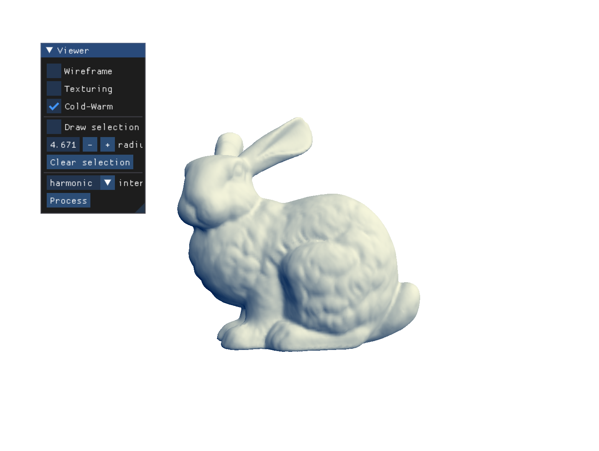
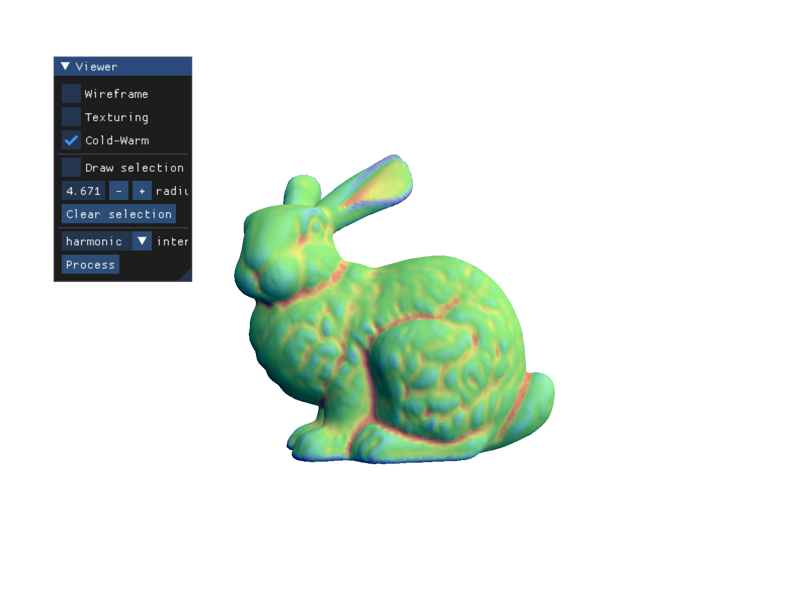
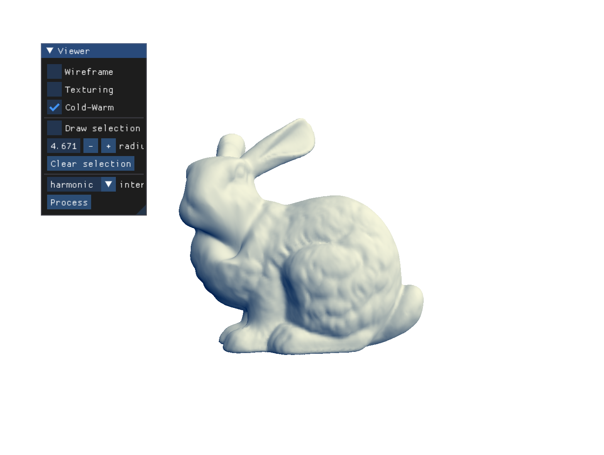
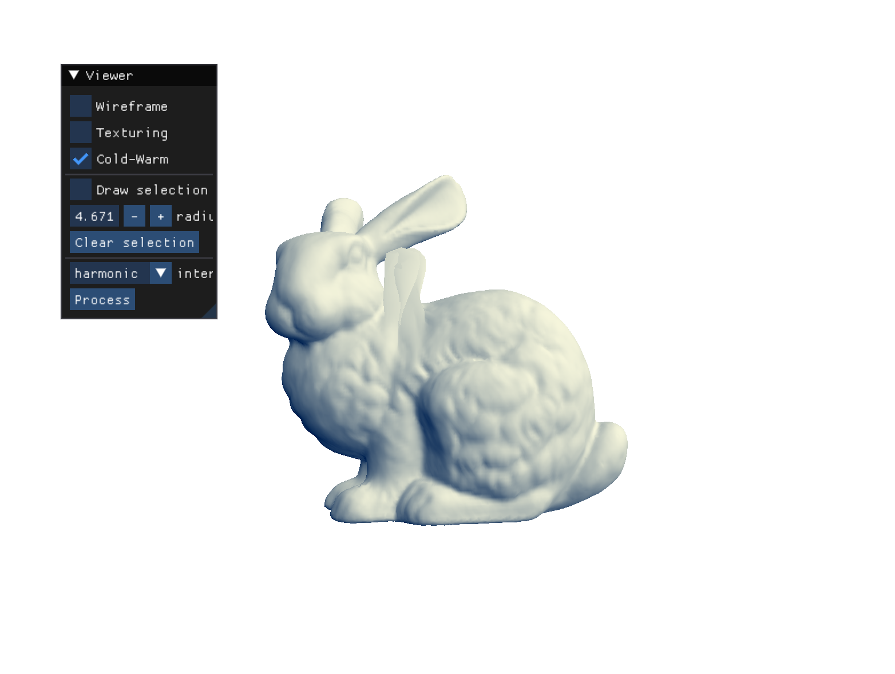

# SIA Mesh Renderer

## Laplacian Matrix

La matrice Laplacienne étant une matrice creuse, elle peut être calculée à partir de triplets représentant les indices en ligne et colone ainsi que la valeur à cette position. La taille est estimée à sept fois le nombre de sommets : un sommet ayant en moyenne 6 voisins, il y aura en moyenne 7 valeurs non nulles par sommet. La valeur en `(i, i)` est définie à l'opposé de la valence du sommet `i`. En `(i, j)`, elle est définie à 1 pour tous les `i`et `j` voisins. 

## Permutation

La permutation est calculée en utilisant un décalage `offset` de chaque côtés du vecteur de taille le nombre de sommets. Ainsi on peut "empiler" les sommets sélectionnés d'un côté, et les autre de l'autre.

## Solver

Le solveur est définie en suivant l'exemple de la documentation, après avoir calculée les éléments précédents importants: `L00`, `L01` et `u1` — ceux-ci étant simplement des portions définies de `L'` et de `u'`.

## Harmonic Reconstruction

**Positions**

Lors de la tentative d'interpolation hamonique, le maillage disparait pour ne laisser qu'un fond blanc. Le problème était dû au type utilisé pour les vecteur du solveur. En effet, l'exemple de la documentation utilise des `VectorXf`, or, nous utilisons un vecteur de `Vector3f`, soit une `MatrixXf`. En changeant le type en question pour `b` et `u`, le résultat semble bien plus réaliste.

On détecte bien une surface d'aire minimale sur la surface sélectionnée.

*N.B.:* Il est impossible de tenter de boucher les trous du maillage `colorfull` étant donné qu'il est impossible pour moi de viser la sélection à cause d'un décalage de plus d'une demie fenêtre d'affichage entre le pointeur et la sélection. J'ai pu me débrouiller avec les autres maillages, mais pour une telle précision c'est impossible. Ce problème est persistant depuis la version de base du projet et n'a pas pu être résolu malgré la tentative avec professeur — sous Apple MacBook Air (2020).

**Colors**

En appliquant l'interpolation harmonique sur les couleurs des sommets pour le maillage en couleurs, on note bel et bien le changement de couleur du rouge au vert au niveau du coup, zone sélectionnée.

## Poly-Harmonic Reconstruction

La simple modification fût d'ajouter la multiplication de la matrice Laplacienne `L` par elle-même une ou deux fois selon le `k` (respectivement 2 ou 3).

Bi-Harmonic Reconstruction: \

Tri-Harmonic Reconstruction: \

On peut constater que les points sont bien plus modifiés selon la valeur de `k`. Le résultat semble a priori correct.

## Cotangent Weights

Les nouveaux poids sont calculés grâce à la formule des co-tangentes. Si l'on considère les angles `α` et `β` formés par les quatre autres arêtes des deux faces en question (les angles "autour" de l'arête en question dans le sous-maillage de deux faces), le poids pour cette arête sera la moyenne des co-tangentes de ces angles.

$$\cot \alpha = \frac{\cos \alpha}{\sin \alpha} \hspace{3cm} \cot \beta = \frac{\cos \beta}{\sin \beta}$$

Le cosinus peut être calculé grâce au produit scalaire (*dot product*) entre les deux vecteurs de l'angle. Le sinus peut quant à lui être calculé comme la norme du produit vectoriel (*cross product*) entre ces vecteurs.

*N.B.:* Pour que ces formules soient vraies, il est nécessaire que les vecteurs utilisés soient normalisés.

Enfin, la gestion des bords a été effectuée de telle sorte à ne calculer que les co-tangentes pertinentes (celles dont la face existe belle et bien).

## Interactive Deformation

La déformation interactive a été mise en place en ajoutant une propriété de déplacement `shift` aux sommets du maillage. Cette propriété est une valeur flottante qui est appliquée comme un déplacement le long de la normale lors du calcul de la position dans le *Vertex Shader*.

Pour la mise en place de cette propriété, le même travail que pour celle notant si le sommet est sélectionné ou non (dans `mask`) a été effectué (`add_vertex_property<float>("v:shift")` à tous les endroits de création, `get_vertex_property<float>("v:shift")` à tous les endroits d'utilisation, ajout dans le *VBO*, transfert aux *Shaders*…).

Pour l'application, lors d'une pression sur la touche '+' ou '-', cette propriété est incrémentée ou dérémentée pour le sommet sélectionné. La fonction `poly_harmonic_interpolation` est alors appelée sur le vecteur de cette propriété pour chaque sommet `shifts`.

## Optimisation

La fonction `poly_harmonic_interpolation` a été modifiée de manière à ne pas créer les éléments `L`, `perm` et `nb_unknowns` elle même mais récupérer ceux déjà créés par l'application.

`L` est initialisée après le chargement du maillage celui-ci n'évoluant pas. `perm` et `nb_unknowns` sont initialisés lors de la sélection de sommets. En passant ces données en paramètre de la fonction `poly_harmonic_interpolation`, le résultat est le même, mais les calculs sont moins fréquents.
