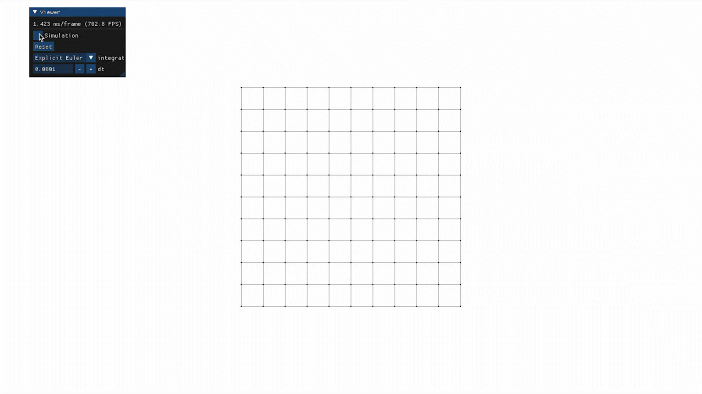
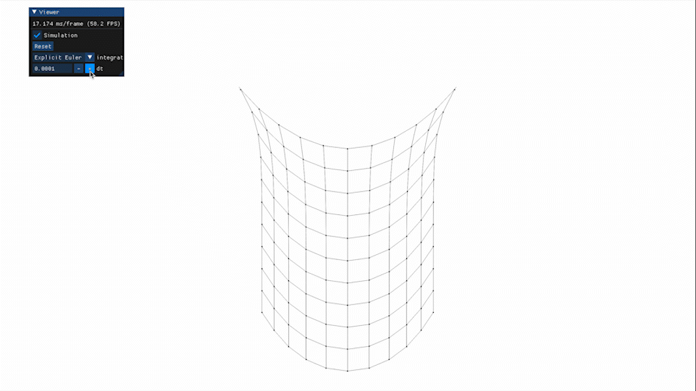
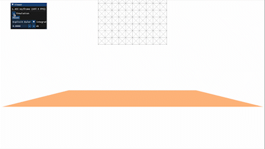
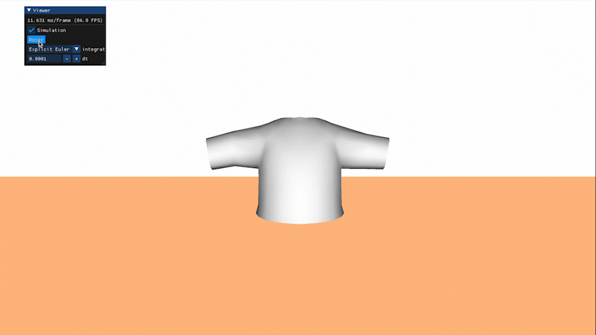
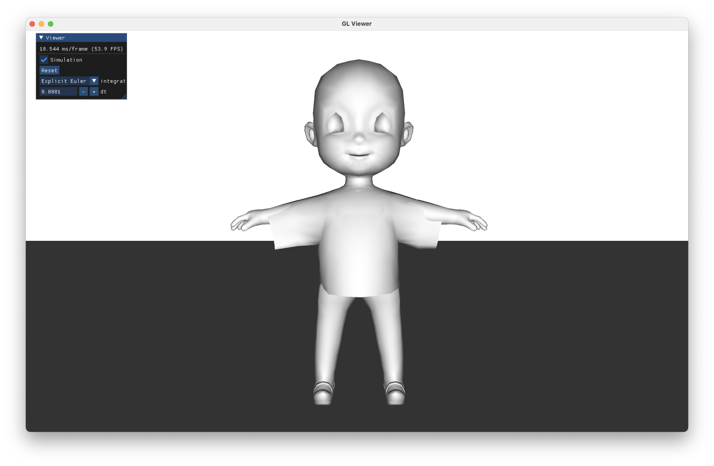

# SIA Mass-Spring

## Forces

**Gravity Force**

La force gravitationnelle correspond à la masse de la particule que multiplie le vecteur d'accélération gravitationelle.

**Drag Force**

L'amortissement visqueux correspond à la résistance au mouvement, opposée à la vitesse et pondéré par le coefficient de viscosité.

**Spring Force**

Le principe est d'ajouter la force du ressort et la force de l'amortisseur à l'une des particules, et son inverse à l'autre.

Ici, une erreur a été commise, bien qu'elle ait été détectée tardivement. La force d'amortisseur n'était pas prise en compte et seule la force du ressort était appliquée.

La détection de cette erreur n'a été faite que lors du premier lancement après l'implémentation du pas d'*Euler* (partie Intégration).

## Particles

**Dimensions**

Pour chaque particule, il y a 6 degrés de libertés. Le nombre de dimensions est donc `6n` avec `n` le nombre de particules

**State**

Le but ici est de mettre en place le transfert des états des particules vers et depuis un vecteur d'états. Celui-ci sera utilisé pour calculer facilement la mise à jour des états des particules lors d'un pas (*Euler* ou *MidPoint*).

**Derivative**

Il faut mettre les forces appliquées à chaque particule à 0, appliquer la somme des forces sur les particules et calculer la dérivée en appliquant la formule.

Une autre erreur difficilement trouvable ici était la réinitialisation des forces appliquées au particules. En effet, la conséquence de cette erreur était une mauvaise initialisation, qui créait une disparition du système dès le début de la simulation.

Comme précédemement, la détection de cette erreur n'a été faite que lors du premier lancement après l'implémentation du pas d'*Euler*.

## Euler Step

Un pas d'*Euler* correspond à l'application aux particules de la mise à jour du vecteur d'états des particules, calculé comme l'état courant auquel s'ajoute la dérivée de ces états modulée par l'intervalle de temps.

En implémentant de pas d'*Euler* et en mettant à jour l'affichage *OpenGL*, on peut visualiser et intéragir avec le système de particule.

## Experiments

### Time Factor

Si l'on change le facteur temps `dt`, le système a un comportement incohérent avant de disparaître complètement.

### Constants Twist

En augmentant la constante de ressort et en diminuant celle d'amortissement, on constate une augmentation de la rigidité globale du système, une perte de stabilité, ainsi qu'un « rebond » plus élevé.

## Shear Springs

En ajoutant les ressorts au niveau des diagonales, on obtient plus de stabilité sur le système et on évite les cisaillements (« écrasement » des particules).

## Middle Point Step

En faisant un pas d'*Euler* on peut récupérer `dt * deriv`. On peut alors l'utiliser pour calculer le nouvel état à `(dt * deriv) / 2` et récupérer sa dérivée. On peut alors calculer le nouvel état en ajoutant à l'originel `dt * deriv` (avec `deriv` la nouvelle dérivée).

On constate donc que la stabilité est nettement meilleure. Comme on peut le voir, on peut aller jusqu'à un `dt` d'enviton 0.0018 avant d'avoir une première légère perte de stabilité, contre 0.0003 avec Euler (avec une perte de stabilité bien plus importante immédiatement).

## Plane Collider

Pour ajouter un sol à la scène, un nouvel objet de type `Mesh *` a été ajouté au `Viewer` et initialisé dans se méthode `init`. Dans la méthode `draw`, celui-ci est dessiné en passant aux shaders sa matrice de transformation et sa couleur.

Concernant la collision, un `PlaneCollider` créé de manière a correspondre au quad nouvellement créé a été ajouté à la liste des `Collider` du système de particules depuis la méthode `Viewer::updateScene`. La méthode `step` du système de particules comprend est mise à jour de manière à itérer sur chaque `Collider` et afin d'évaluer une collision avec chaque particule du système. Enfin, la méthode `PlaneCollider::colision()` dont il est justement question ici est implémentée de telle sorte à inverser la composante normale de la vélocité de la particule en fonction d'un coefficient de rebond, s'il y a collision avec le `PlaneCollider`. En outre, s'il y a dépassement, la position est mise à jour de manière à rester à l'extérieur du `PlaneCollider`.

## Cloth

Tout d'abord, il faut charger et initialiser le maillage du vêtement dans un attribut `Mesh *` de `Viewer`, ainsi qu'exporter le système de particules à partir de ce maillage. Cette action est effectuée dans la méthode `Viewer::updateScene` dans la partie réinitialisation.

Ensuite, la méthode `Viewer::draw` doit afficher le maillage grâce au shader de Blinn-Phong, en utilisant l'éclairage déjà mis en place. Il faut donc passer aux shaders les variables uniformes nécessaires (transformations, normales, …).

Enfin, dans le but de faire coincider le maillage et le système de particules, il faut mettre à jour le maillage à chaque pas de la simulation selon le système de particules, grâce à la méthode `Mesh::updatePos`.

## Girl

Après avoir chargé le maillage, on peut utiliser la BVH et la méthode du lancer de rayon pour permettre de calculer les collisions des particules avec les faces intersectant le rayon à une distance très petite.

