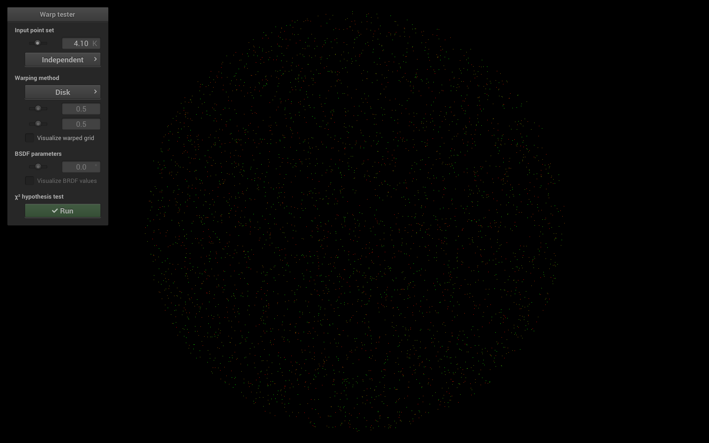
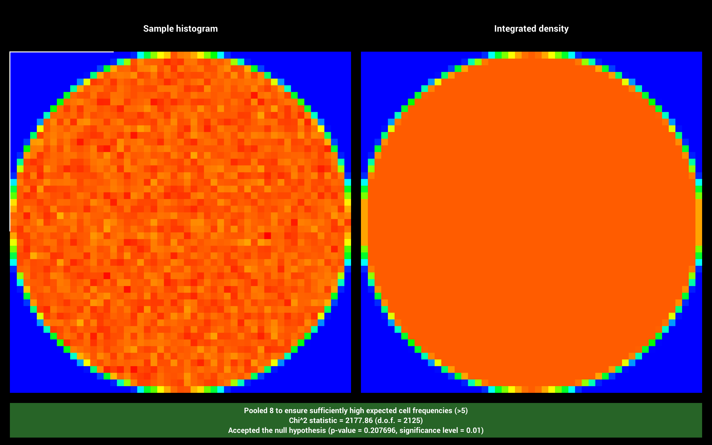
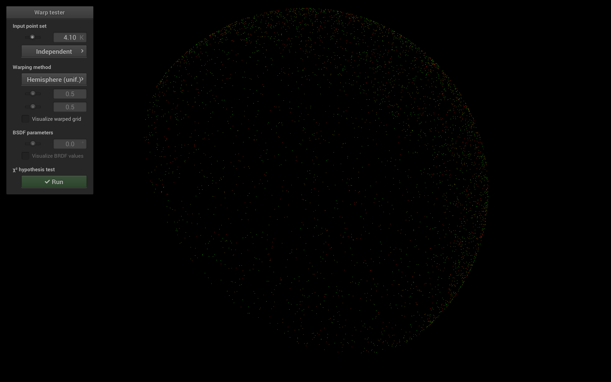
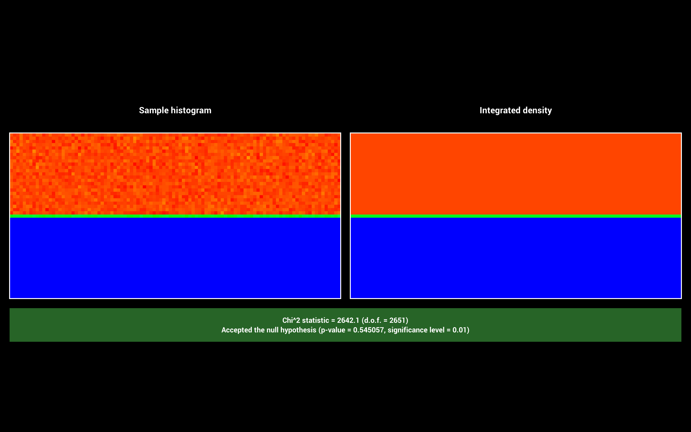
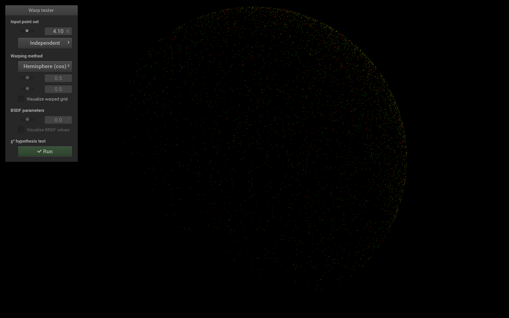
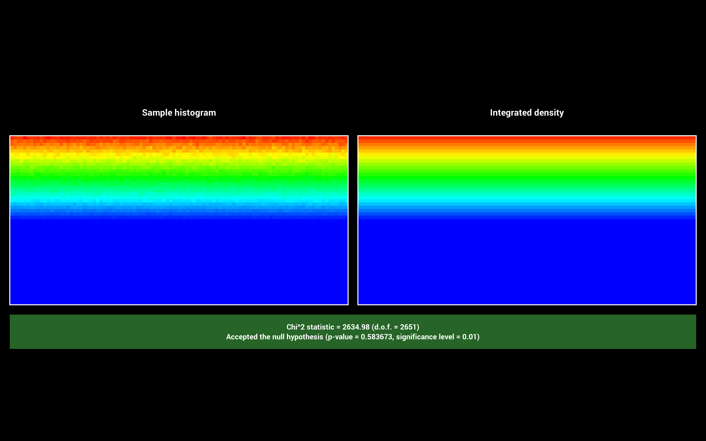
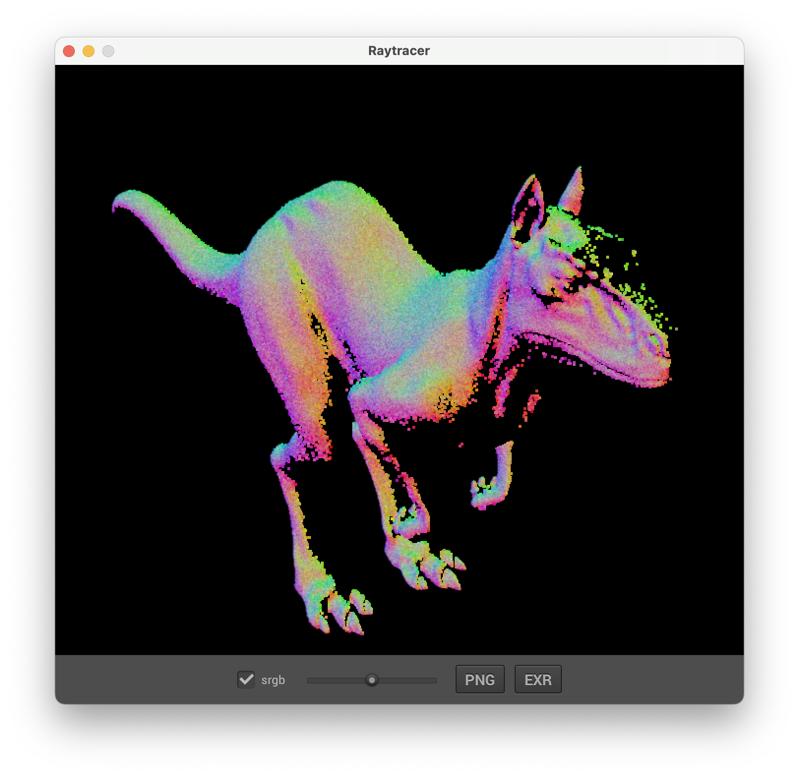
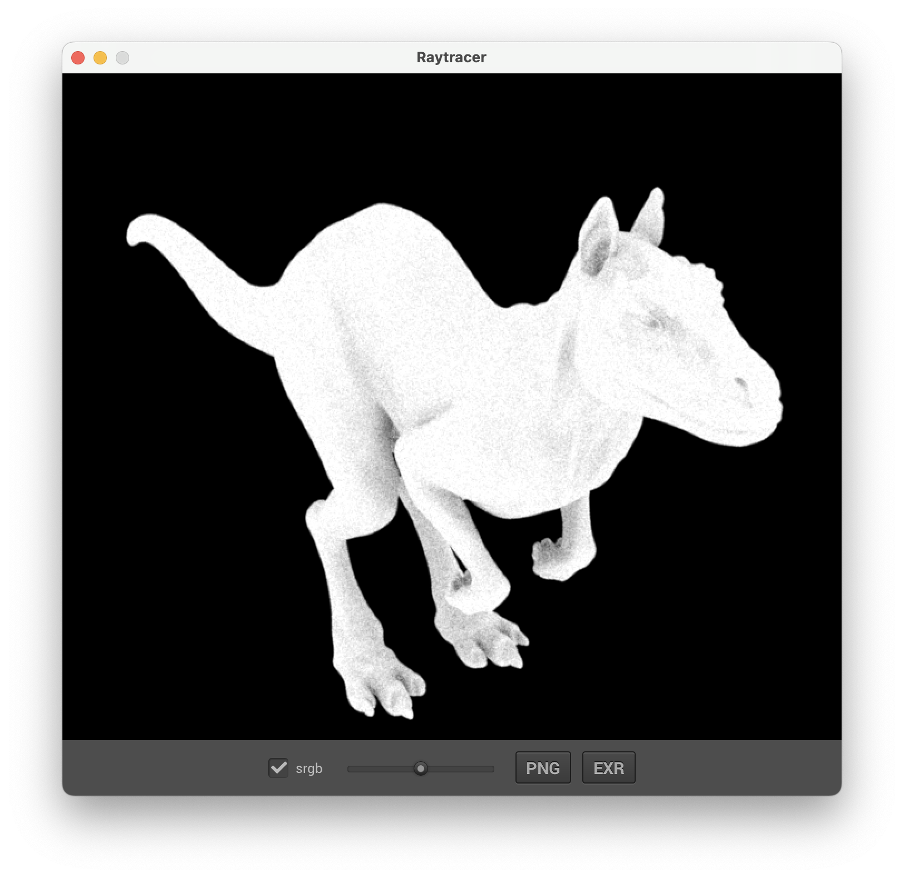
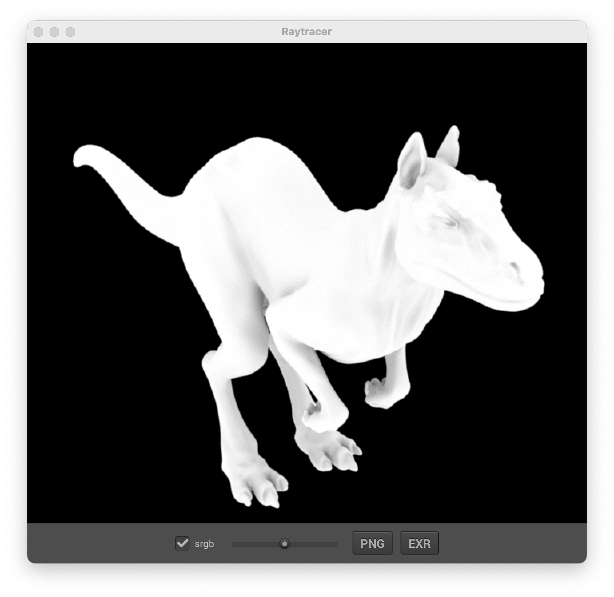

Bastien Soucasse — SIA

# Monte-Carlo Integration

## Ambiant Occlusion

Le facteur `pi` dans l'équation correspond à la normalisation de la prise en compte de toutes les directions dans le calcul de l'occlusion ambiante (de 0 à `pi`). La valeur de l'occlusion ambiante est comprise entre 0 et 1.

### Disk Sampling

$$r = \sqrt{\xi_1}$$

$$\phi = 2 \pi \xi_2$$

$$p = \begin{bmatrix} r \cos \phi \\ r \sin \phi \end{bmatrix}$$

$$\text{pdf} = \frac{1}{\pi}$$




### Hemisphere Sampling

**Version 1**

$$\phi = 2 \pi \xi_1$$

$$\theta = \cos^{-1} \xi_2$$

$$p = \begin{bmatrix} \sin \theta \cos \phi \\ \sin \theta \sin \phi \\ \cos \theta \end{bmatrix}$$

$$\text{pdf} = \frac{1}{2 \pi}$$




**Version 2**

$$\phi = 2 \pi \xi_1$$

$$\theta = \cos^{-1} \sqrt{1 - \xi_2}$$

$$p = \begin{bmatrix} \sin \theta \cos \phi \\ \sin \theta \sin \phi \\ \cos \theta \end{bmatrix}$$

$$\text{pdf} = \frac{\cos \theta}{\pi}$$




### Ambiant Occlusion

Le principe de l'implémentation de l'occulation ambiante n'a pas été acquise du premier coup. En effet, le premier visuel obtenu était très différent de celui attendu.



Concrètement, un seul rayon était lancé (oui, après coup ça paraît bête), le calcul mis en place était `hit.toWorld(d) * d.z() / pdf` pour retrouver directement une couleur. La normalisation était déjà mise en place mais sur un calcul erroné.

En modifiant ce code en implémentant un lancer de rayon par échantillon utilisé, et en modifiant la formule évidemment, on obtient désormais ce qui est attendu, que ce soit pour *uniform* ou pour *cosine*.


En termes de performances, les deux méthodes sont relativement similaires ; la seconde est à peine plus rapide.

```txt
Uniform Hemisphere: 892.0ms.
Cosine Hemisphere: 724.0ms.
```

En termes de convergence, il faut moins d'échantillons pour converger vers la véritable valeur de l'intégrale. En effet, la seconde méthode prend en compte l'importance apportée aux directions proches de la normale (apportée par le terme cosinus dans la formule de Monte-Carlo).

Si l'on compare l'utilisation de 1 échantillon par pixel et 32 pour l'AO et l'inverse, on peut constater que la différence n'est pas très importante.

Uniform: \



Cosine: \


La différence notable cependant est au niveau de l'antialiasing. En effet, la version originelle comporte de l'aliasing, alors que l'inverse est lissé.

En guise de test, on peut tenter de mettre 32 échantillons par pixel et 32 aussi pour l'AO. Le temps de rendu est bien plus long mais le rendu est de qualité élevé.




## Extended Light Sources

### Area Light

La méthode `AreaLight::intensity` se contente de vérifier s'il s'agit bien d'une face avant de la shape, ou sinon que le flag TwoSided est activé. Si cette vérification passe, alors on retourne simplement l'intensité de la light.

La méthode `AreaLight::sample` quant à elle, commence en calculant la position, la normale et la pdf d'un point associé à un échantillon 2D généré aléatoirement passé en paramètre. Il est alors possible de calculer le vecteur w et la distance entre le point d'origine à la surface et le point de la source généré. On peut alors transformer la pdf en mesure d'angle solide, puis retourner la valeur d'intensité retournée par la méthode précédente.

### DirectLMS Integrator

L'intégrateur DirectLMS se base sur l'intégrateur Direct. Il faut alors ajouter la prise en compte d'une lumière rencontrée via le rayon primaire ajoutant à la radiance (initialisée à 0) l'intensitée de cette première lumière. Ensuite, pour chaque lumière de la scène, on garde le même comportement que pour l'intégrateur Direct, auquel on ajoute la prise en charge des AreaLight (le cas où la shape de la light est la même que celle du hit). En répétant ce procédé un nombre de fois défini par l'attribut `sampleCount` récupéré à partir de la scène, on obtient une réitération que l'on peut moyenner pour obtenir la valeur finale de la radiance.

Cependant, le code implémenté n'est pas fonctionnel et je ne suis pas parvenu à trouver comment résoudre le problème. En effet, aucun des test n'a donné autre chose qu'un écran complètement noir.

### Mesh as Extended Light Source

La méthode `Mesh::sample` utilise la Discrete PDF (DPDF) et notament sa méthode `sampleReuse` pour récupérer une face sur cette mesh. La prise en compte de l'aire se fait via l'attribut `area` défini dans la méthode `Mesh::activate`. Enfin, la méthode `Warp::squareToUniformTriangle` a été implémentée pour remapper le carré en triangle. `Warp::squareToUniformTrianglePdf` a également été implémentée et testée via wraptest.

Malheureusement, suite au problème précédent, il est impossible de visualiser le résultat de cette partie, comme précédemment.
