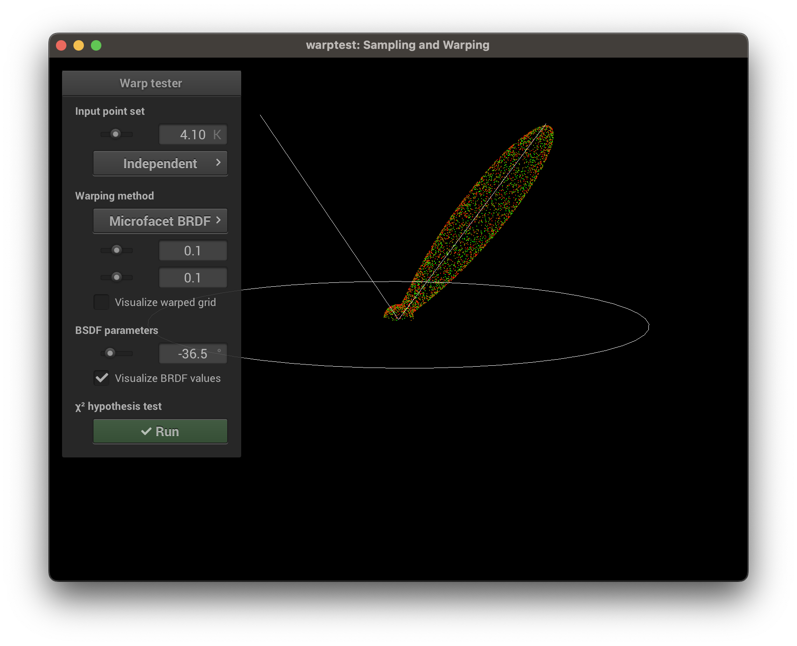

Batien Soucasse — SIA

# BRDF à microfacettes

## 1. Évaluation et échantillonnage de la distribution de Beckmann

On échantillonne la distribution de Beckmann, et on teste le résultat (échantillons et PDF pour différents paramètres) avec `warptest`.

**𝛼 = 0.1**

**𝛼 = 0.5**

**𝛼 = 1**

## 2. Évaluation de la BRDF à microfacettes

On évalue la BRDF à microfacettes avec un éclairage direct, en utilisant la scène `scene/ajax/ajax_microfacet.scn`.

**𝛼 = 0.03**

**𝛼 = 0.1**

**𝛼 = 0.3**

**𝛼 = 0.6**

On peut constater que les parties éclairées sont un peu trop saturées. Cela est due à une erreur (bête) dans l'implémentation de la BRDF à microfacettes (un signe `+` au lieu d'un signe `*`).

**𝛼 = 0.03**

**𝛼 = 0.1**

**𝛼 = 0.3**

**𝛼 = 0.6**

## 3. Échantillonnage uniforme de la BRDF

On échantillone uniformément la BRDF avec 32 échantillons, en utilisant la scène `scene/ajax/ajax_microfacet_envmap.scn`.

**𝛼 = 0.03**

**𝛼 = 0.1**

**𝛼 = 0.3**

**𝛼 = 0.6**

## 4. Échantillonnage préférentiel de la BRDF

On échantillone la BRDF, et on teste le résultat (échantillons et PDF pour différents paramètres) avec `warptest`.

**𛼠= 0.1, kd = 0.1, θ = -36.5**

**𛼠= 0.2, kd = 0.1, θ = -36.5**

**𛼠= 0.2, kd = 0.1, θ = -46.2**

Malgré l'échec du test dans le dernier cas, tous les résultats sont cohérents. Afin tout de même de vérifier la validité de ces résultats, on teste la programme avec les fichiers de test `tests/chi2test-microfacet.scn` et `tests/ttest-microfacet.scn`. Les 20 tests de ceux-ci passent, l'implémentation est donc un succès.

On échantillonne alors de manière préférentielle la BRDF avec 32 échantillons, en mettant le terme booléen `IS` à vrai dans le fichier de la scène `scene/ajax/ajax_microfacet_envmap.scn`.

**𝛼 = 0.03**

**𝛼 = 0.1**

**𝛼 = 0.3**

**𝛼 = 0.6**

On peut constater que sur des valeurs de 𝛼 plus petites, qui rendent l'objet plus brillant, le rendu est bien meilleur avec `IS` (à droite). Alors que pour des valeurs de 𝛼 plus grandes, qui rendent l'objet plus mat, le rendu est équivalent, avec peut-être légèrement plus de bruit dans la version avec `IS`. La version avec `IS` est donc bien meilleure de manière générale.
