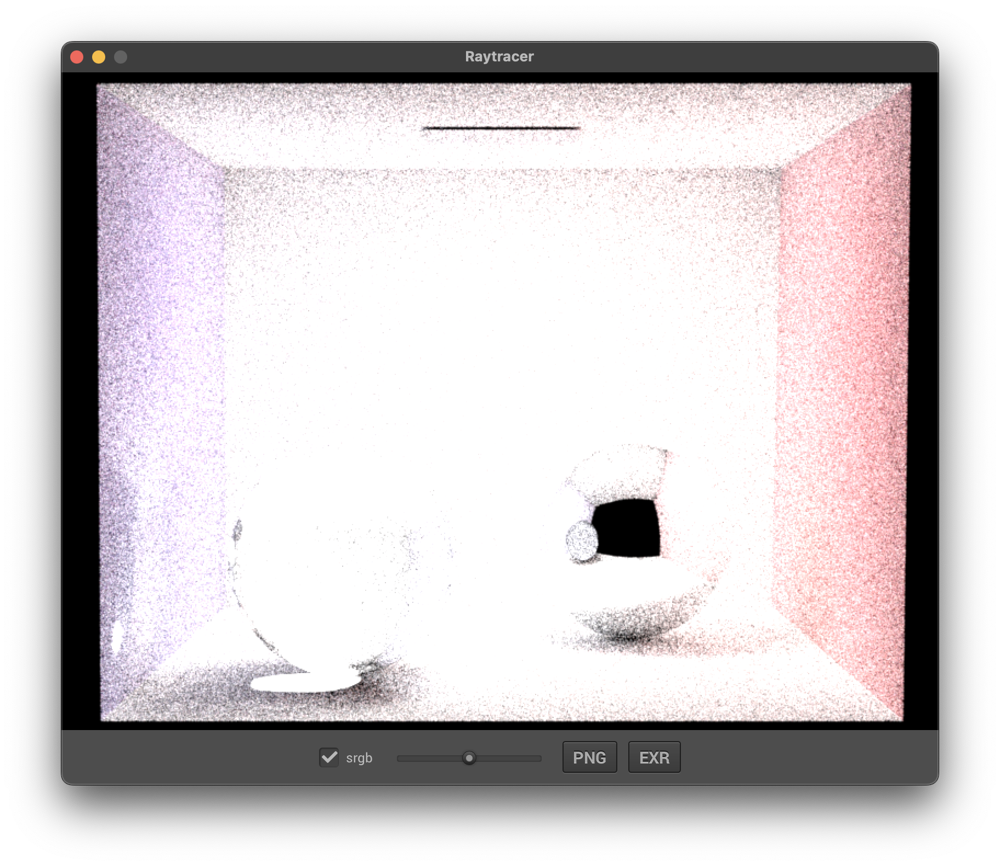
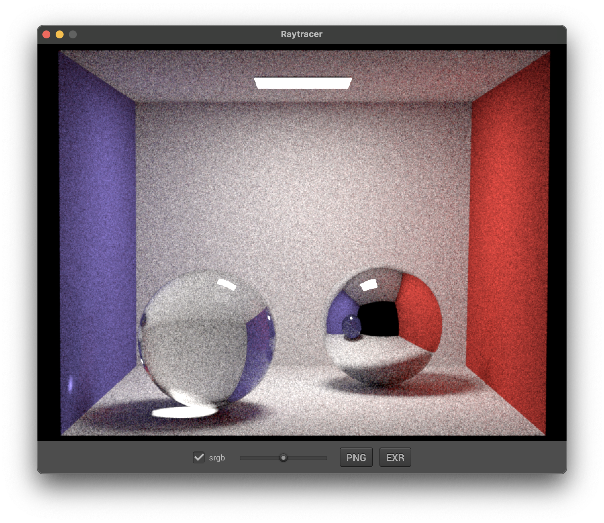
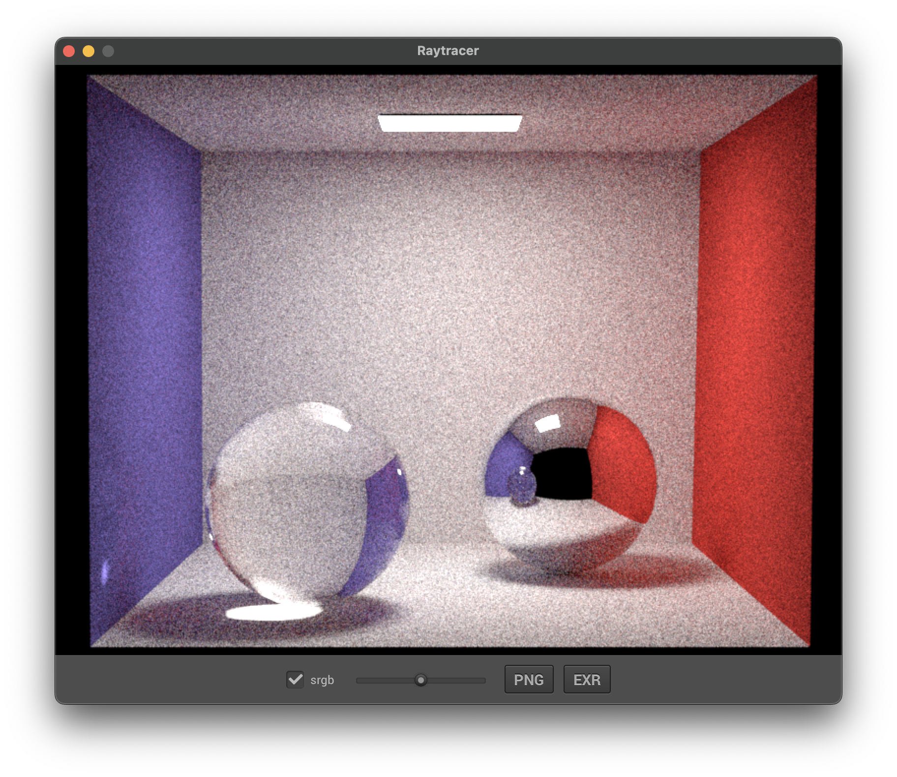
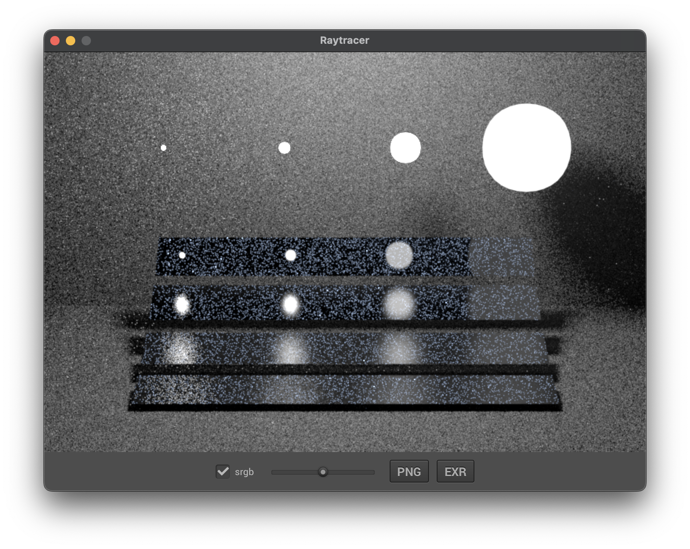

Batien Soucasse — SIA

# Path Tracing

## Tracé de chemin par échantillonnage de la BSDF

En repensant l'intégrateur Whitted, on peut commencer par changer la récursion en une boucle sur le nombre d'itérations. Il faut également supprimer l'échantillonage sur les sources lumineuses.

On peut alors mettre en place le calcul du flux comme le produit des valeurs retournées par `bsdf->sample()`.

Si aucune intersection n'est trouvée, on à la radiance la couleur d'arrière plan pondérée par le flux actuel, et c'est également une condition d'arrêt du chemin.

Dans le cas où le rayon touche une source lumineuse, on ne met pas fin au chemin, mais on ajoute à la radiance l'intesité luminause de la source pondérée par le flux actuel.

On peut constater que l'image est très claire et non réaliste. J'avais mis par erreur un `+` au lieu d'un `*` sur le calcul du flux.

Maintenant que le résultat est cohérent, on peut mettre en place la roulette Russe. Tout d'abord, on doit mettre en place le calcul de l'eta comme le produit des eta de chaque query. Grâce à cela, on peut mettre en place le calcul de la probabilité de continuer le chemin à chaque itération (au delà de 3 itérations) comme la composante maximale du flux actuel multiplé par le carré de l'eta actuel. Il faut penser à mettre à jour le calcul du flux en le divisant par cette probabilité, et aussi à enlever le nombre d'itérations comme condition d'arrêt.

